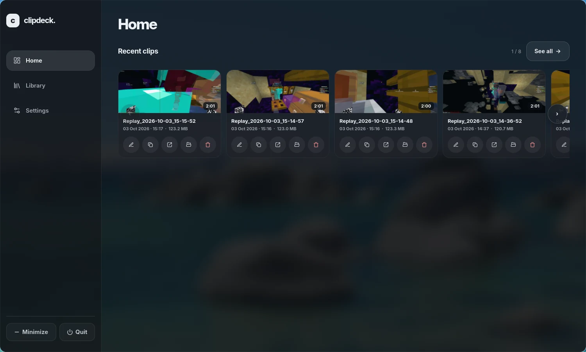
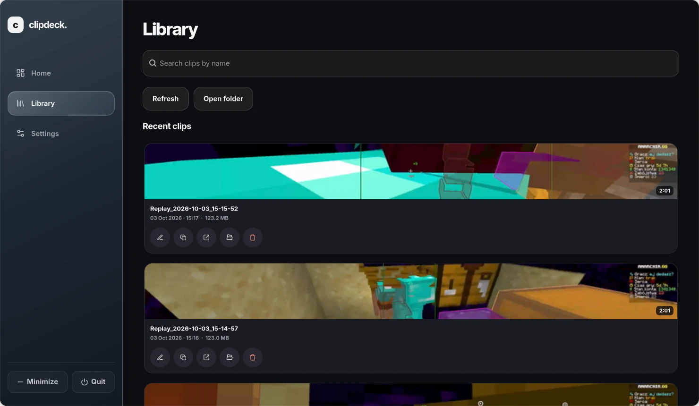
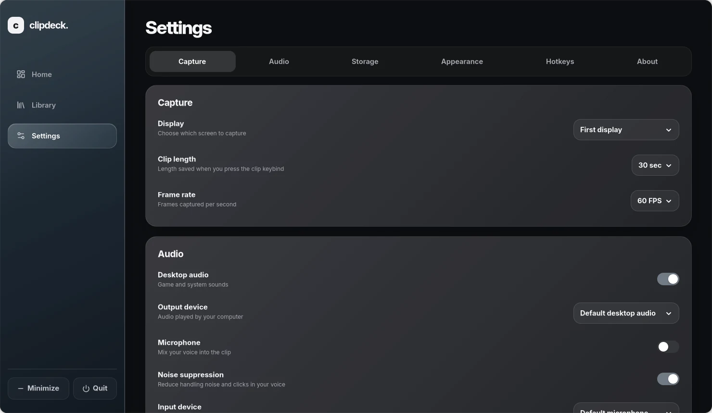

# Clipdeck

Clipdeck is a local game clipper and screen recorder for Linux. It keeps a rolling replay ready, so a keybind can save the last few seconds without opening OBS Studio. The app uses [GPU Screen Recorder](https://git.dec05eba.com/gpu-screen-recorder/about/) for capture and provides an in-app clip library, playback, and trimming.

**Website:** [getclipdeck.pages.dev](https://getclipdeck.pages.dev/) — see the app and installation instructions.

## Screenshots

### Home



### Library



### Settings



## Supported systems

The installer detects Arch Linux and Arch derivatives such as CachyOS, plus Ubuntu and Linux Mint. Clipdeck uses GTK 4, Libadwaita, FFmpeg, MPV, and GPU Screen Recorder. Capture also depends on your GPU, driver, desktop session, and its screen-sharing portal; installing the app alone cannot guarantee that every combination works. The current checkout has been exercised on Arch; Ubuntu and Mint installation paths are implemented but still need a real-machine check.

On Wayland, install the `xdg-desktop-portal` backend for your desktop if display capture asks for one. On Ubuntu or Mint, follow the [GPU Screen Recorder source installation steps](#ubuntu--linux-mint-gpu-screen-recorder) before running Clipdeck. The Clipdeck installer installs distribution packages with `sudo` but does not run an upstream build script as root.

## Install

On Arch or CachyOS, clone the repository and run the installer as your normal user:

```bash
git clone https://github.com/Filip1x3/clipdeck.git && cd clipdeck && bash ./install.sh
```

### Ubuntu / Linux Mint: GPU Screen Recorder

Clipdeck needs both `gpu-screen-recorder` and `gsr-cli` as system commands. The upstream project recommends [building from its official source](https://git.dec05eba.com/gpu-screen-recorder/about/) on non-Arch distributions. These package names are an example for Ubuntu 24.04 and Linux Mint 22; other releases may need different packages. This installation path has not yet been tested on a real Ubuntu or Mint machine.

Install the build tools and libraries:

```bash
sudo apt update
sudo apt install git meson ninja-build pkg-config build-essential \
  libavcodec-dev libavformat-dev libavutil-dev libswresample-dev libavfilter-dev \
  libx11-dev libxcomposite-dev libxrandr-dev libxfixes-dev libxdamage-dev \
  libwayland-dev wayland-protocols libva-dev libpulse-dev libdrm-dev libcap-dev \
  libdbus-1-dev libpipewire-0.3-dev libglvnd-dev libvulkan-dev linux-libc-dev
```

Download and install GPU Screen Recorder from its source repository:

```bash
git clone https://repo.dec05eba.com/gpu-screen-recorder
cd gpu-screen-recorder
sudo ./install.sh
command -v gpu-screen-recorder && command -v gsr-cli
```

Both paths must print before you continue. Then install Clipdeck as your normal user:

```bash
cd ..
git clone https://github.com/Filip1x3/clipdeck.git
cd clipdeck
bash ./install.sh
```

The [Flatpak version](https://git.dec05eba.com/gpu-screen-recorder/about/) runs its CLI inside the Flatpak sandbox; installing it alone does not put the two commands in the host `PATH` expected by Clipdeck. If the source build fails, check the upstream dependency list and your GPU driver before retrying.

The installer asks for `sudo` only when it needs system packages. It checks required commands and GTK libraries, makes the launch scripts executable, installs the application launcher, and adds background capture to login startup. Keep the cloned directory where it is: the launcher and keybinds refer to its `run.sh` by absolute path.

Installer options:

```bash
bash ./install.sh --check          # Check dependencies without installing anything
bash ./install.sh --no-autostart   # Install without capture at login
bash ./install.sh --no-deps        # Use dependencies already installed on the system
```

Open **Clipdeck** from your application menu after installation. You can also run `./run.sh` from the checkout.

## Update or uninstall

First choose **Quit** in Clipdeck (or its tray menu). Open a terminal in the same `clipdeck` directory you cloned during installation. Keep this directory in place while Clipdeck is installed because the launcher and keybinds use its absolute path.

To update, run:

```bash
bash ./update.sh
```

This pulls the latest commit with `git pull --ff-only` and refreshes the launcher without reinstalling system packages. If your checkout predates `update.sh`, run `git pull --ff-only && bash ./install.sh --no-deps` once. Restart Clipdeck from the application menu afterward. If Git reports local changes or a branch conflict, resolve that first; the updater will not overwrite your edits.

To uninstall, run:

```bash
bash ./uninstall.sh
```

This removes Clipdeck's user launcher, autostart, registered shortcuts, and bundled font when they still belong to this checkout. It keeps your recorded clips and `~/.config/clipdeck/settings.json`. After the command finishes, you may delete the cloned `clipdeck` directory yourself. System packages, including GPU Screen Recorder, are shared dependencies and are not removed. To install again later, clone the repository and run `bash ./install.sh` as shown above.

## Using Clipdeck

- **Save a clip:** Set a keybind under **Settings → Hotkeys**, then press it while playing. Clipdeck saves the latest part of its rolling replay as an MKV file. You can choose the clip length under **Capture** and a maximum file size under **Storage**. Files larger than the limit are recompressed after capture; this may reduce visual quality, but does not shorten the clip.
- **Record a full session:** Use the recording control or its separate keybind to start and stop a recording.
- **Browse and edit:** **Home** shows recent clips; **Library** has a searchable grid. Click a clip for in-app playback. You can pause with Space, seek, change speed, use fullscreen, rename, trim to a new file, copy its path, open it in another player, or delete it after confirmation. Trimming keeps the source file.
- **Capture audio:** Select desktop audio and a microphone under **Audio**. The microphone test shows a live level and plays your test recording back. Noise suppression is available through the local PulseAudio/PipeWire WebRTC echo-cancel module.
- **Appearance:** Choose Default or Liquid Glass, background blur, and a clip-saved popup and sound. Preview controls are available in **Settings → Appearance**.
- **Background use:** Minimizing or closing the window leaves Clipdeck running in the tray. The tray menu opens the app or Library and offers Quit. Quit attempts to stop capture before exiting and reports a stop error if one occurs.

Clips default to `~/Videos`. Settings are stored in `~/.config/clipdeck/settings.json`; thumbnails are cached under `~/.cache/clipdeck/thumbnails`. Capture can start at login when the installer adds autostart. The encoded rolling replay uses RAM, so very long clip lengths can consume substantial memory. A desktop screen-capture indicator may remain visible while the rolling replay is active.

## Global keybinds

In **Settings → Hotkeys**, click **Set keybind** and press F1–F24, or use a key with Ctrl, Alt, or Super. Save the pending settings to apply the keybind. Clipdeck registers shortcuts automatically in GNOME, Cinnamon, and Hyprland, including Caelestia. On a standard Hyprland setup it adds one include to `~/.config/hypr/hyprland.conf` or `hyprland.lua` and writes its bindings to a separate `clipdeck-binds` file. It backs up the original configuration before editing it.

On another desktop, set these commands as custom global shortcuts in your desktop's keyboard settings:

```text
<path-to-checkout>/run.sh --save-replay
<path-to-checkout>/run.sh --toggle-recording
```

## Troubleshooting

| Problem | Check |
| --- | --- |
| No display to capture | Select a display in **Settings → Capture**. On Wayland, try **Choose with system dialog** and check your desktop's portal backend. |
| No desktop sound or microphone | Select the correct output and input devices in **Settings → Audio**. Use **Test microphone** before recording. |
| No global keybind | Save the keybind in Clipdeck settings, then check for conflicts in your desktop's shortcut manager. On Hyprland, run `hyprctl binds` to see active bindings. Automatic registration covers standard Hyprland, Caelestia, GNOME, and Cinnamon. |
| Clip saving fails | Run `bash ./install.sh --check`, then check `./run.sh --status` and the capture log at `${XDG_RUNTIME_DIR:-/tmp/clipdeck-$(id -u)}/clipdeck/recorder.log`. |
| Launcher stops working after moving the folder | Run `bash ./install.sh --no-deps` again from the new location. |

## Privacy and dependencies

Clips, thumbnails, microphone tests, and settings stay on your machine. Clipdeck has no account, cloud upload, or telemetry in its runtime code. The microphone test uses a temporary local file that is removed when the test ends. Capture runs through GPU Screen Recorder; previews and trims run through local FFmpeg/MPV processes. The installer contacts your package repositories when installing dependencies.

The bundled Inter font is licensed under SIL OFL 1.1 (`assets/fonts/OFL.txt`). The bundled Lucide icons carry ISC terms, with MIT terms for Feather-derived icons (`assets/icons/LICENSE`). The notification sounds are original tones synthesized by `scripts/generate_sounds.py`; they contain no sampled audio. The application source does not yet have a project license declaration.

## Development

Run the test suite from the checkout:

```bash
python3 -m unittest discover -s tests -q
python3 scripts/generate_sounds.py --check
```

Clipdeck is a Python GTK application. `clipdeck/ui.py` contains the interface, `clipdeck/recorder.py` controls GPU Screen Recorder, `clipdeck/player.py` provides previews, and `install.py` handles system integration.

The published website is at [getclipdeck.pages.dev](https://getclipdeck.pages.dev/).
